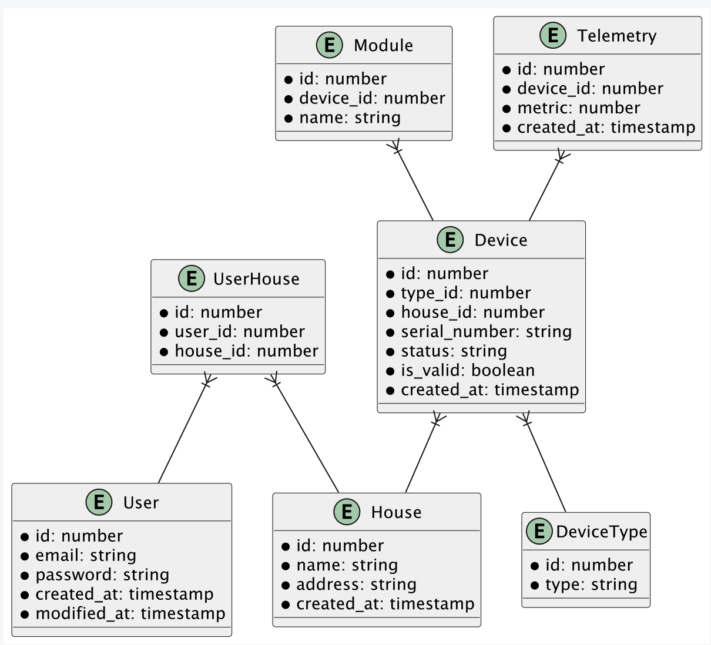

# Решение для заданий Sprint 3

## Задание 1. Анализ и планирование

### Определите домены и границы контекстов.
Домены и контекст
- Управление устройствами
  - Получение данных (температура, состояние и тд)
  - Управление устройствами (вкл./выкл, регулирование параметров)
  - Регистрация новых устройств

- Сценарии для устройств
  - Создание/Редактирование/Удаление сценариев запусков
  - Запуск сценариев по расписанию

- Мониторинг
  - Создание/Редактирование/Удаление отчетов
  - Аналитика
  
- Управление пользователями
  - Регистрация/Создание пользователей
  - Управление профилем
  - Просмотр подключенных устройств

- Тех. поддержка
  - Обработка тикетов на тех. поддержку

- Оплата
  - Обработка оплаты
  - Рекурентные платежи

Можно подумать еще над разными доменами, которые можно добавить. В данный момент, решил остановится на этих.

### Проведите анализ архитектуры монолитного приложения.

**Бизнес ограничения**
- Для подключения нового устройства требуется помощь специалиста, что может существенно влиять на возможно масштабирования компании
- В монолитное решение в будущем при добавлении новых датчиков(устройств), нагрузка будет увеличиваться на все компоненты системы 

**Технические ограничения**
- Монолитная архитектура не позволяет масштабировать отдельные функции приложения
- Сложность добавления нового функционала из-за сильной связанности компонентов
- Полностью синхронное взаимодействие замедляет ответ пользователю
- Все управление происходит только после считывания сервером данных из устройств, что делает создания сценариев сложным(невозможным) процессом

У данного решения(монолитного), есть множество еще разных проблем, связанных с архитектурой. Я выбрал самые явные.

Стек технологий:
- PostgreSQL
- Java

### Визуализируйте контекст системы.
Прикрепил визуал диаграмы C4 context, где описал как система выглядит в целом.
Сам файл находится в корне проекта -> [C4_Context](C4_Context.puml) 


## Задание 2. Проектирование микросервисной архитектуры
Разбил на следующие домены и микросервисы:
- Управление устройствами
  - Микросервис
    - DeviceManagementService
- Работа с телеметрией устройств
  - Микросервис
    - SensorTelemetryService
- Сценарии для устройств
  - Микросервис
    - DeviceScenarioService
- Мониторинг
  - Микросервис
    - MonitoringService 
- Управление пользователями
  - Микросервис
    - UserManagementService
- Тех. поддержка
  - Микросервис
  - TechnicalSupportService
- Оплата
  - Микросервис
    - PaytmentGatewayService

Описание функций Микросервисов:
- DeviceManagementService
  - Функции
    - Управление устройствами (вкл./выкл, регулирование параметров)
    - Регистрация новых устройств
    - Отображения устройств пользователя
  - Стек
    - Python
    - PostgreSQL
- SensorTelemetryService
  - Функции
    - Сохранение данных сенсоров
    - Отображение данные
  - Стек
    - Python
    - MongoDB
- DeviceScenarioService
  - Функции
    - Создание/Редактирование/Удаление сценариев устройств
    - Отображение сценариев пользователей
    - Запуск сценариев по расписанию 
  - Стек
    - Python
    - PostgreSQL
- MonitoringService
  - Функции
    - Создание отчетов
  - Стек
    - Python
    - Greenplum, ClickHouse
- UserManagementService
  - Функции
    - Регистраниця пользователей
    - Создание дома
    - Смена пароля
    - Редактирование персональных данных
    - Верификация
  - Стек
    - Python
    - PostgreSQL
- TechnicalSupportService
  - Создание тикетов
  - Обработка тикетов
  - Стек
    - Python
    - MongoDB
- PaytmentGatewayService
  - Оплата подписки на сервис
  - Рекурентные платежы
  - Стек
    - Python
    - PostgreSQL

### Визуализируйте архитектуры
Тут буду благодарен за помощь, мне не до конца понятно, что нужно указать на диаграме кода. 

Диаграмма контейнеров -> [C4_Container](C4_Container.puml)

Диаграмма компонентов -> [C4_Component](C4_Component.puml)


## Задание 3. Разработка ER-диаграммы



ER Diagram -> [ER Diagram](er_diagram.puml)


## Конец 
<hr />


# Базовая настройка

## Запуск minikube

[Инструкция по установке](https://minikube.sigs.k8s.io/docs/start/)

```bash
minikube start
```

## Добавление токена авторизации GitHub

[Получение токена](https://github.com/settings/tokens/new)

```bash
kubectl create secret docker-registry ghcr --docker-server=https://ghcr.io --docker-username=<github_username> --docker-password=<github_token> -n default
```

## Установка API GW kusk

[Install Kusk CLI](https://docs.kusk.io/getting-started/install-kusk-cli)

```bash
kusk cluster install
```

## Смена адреса образа в helm chart

После того как вы сделали форк репозитория и у вас в репозитории отработал GitHub Action. Вам нужно получить адрес образа <https://github.com/><github_username>/architecture-sprint-3/pkgs/container/architecture-sprint-3

Он выглядит таким образом
```ghcr.io/<github_username>/architecture-sprint-3:latest```

Замените адрес образа в файле `helm/smart-home-monolith/values.yaml` на полученный файл:

```yaml
image:
  repository: ghcr.io/<github_username>/architecture-sprint-3
  tag: latest
```

## Настройка terraform

[Установите Terraform](https://yandex.cloud/ru/docs/tutorials/infrastructure-management/terraform-quickstart#install-terraform)

Создайте файл ~/.terraformrc

```hcl
provider_installation {
  network_mirror {
    url = "https://terraform-mirror.yandexcloud.net/"
    include = ["registry.terraform.io/*/*"]
  }
  direct {
    exclude = ["registry.terraform.io/*/*"]
  }
}
```

## Применяем terraform конфигурацию

```bash
cd terraform
terraform init
terraform apply
```

## Настройка API GW

```bash
kusk deploy -i api.yaml
```

## Проверяем работоспособность

```bash
kubectl port-forward svc/kusk-gateway-envoy-fleet -n kusk-system 8080:80
curl localhost:8080/hello
```

## Delete minikube

```bash
minikube delete
```
